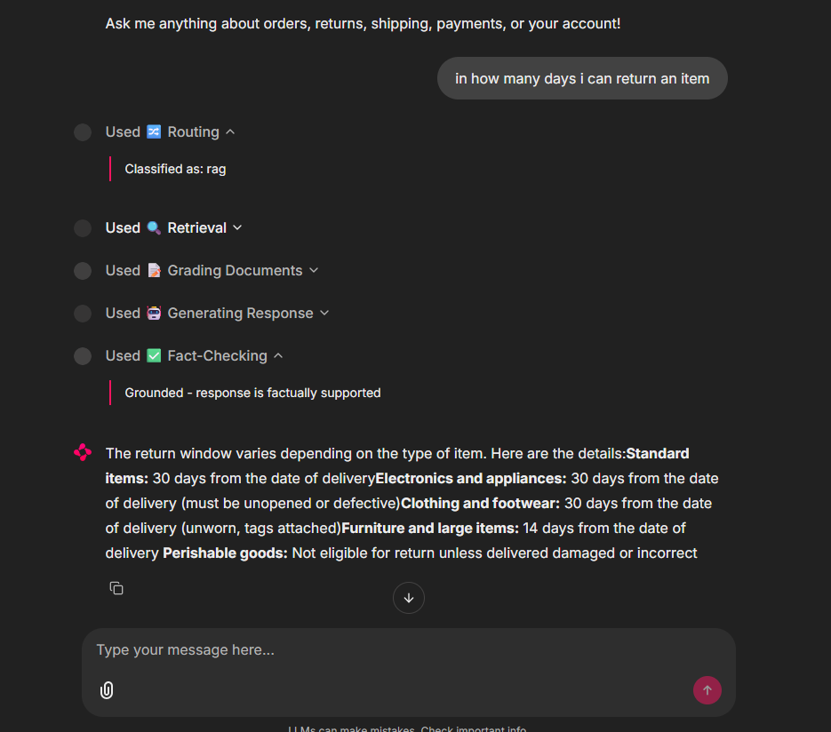
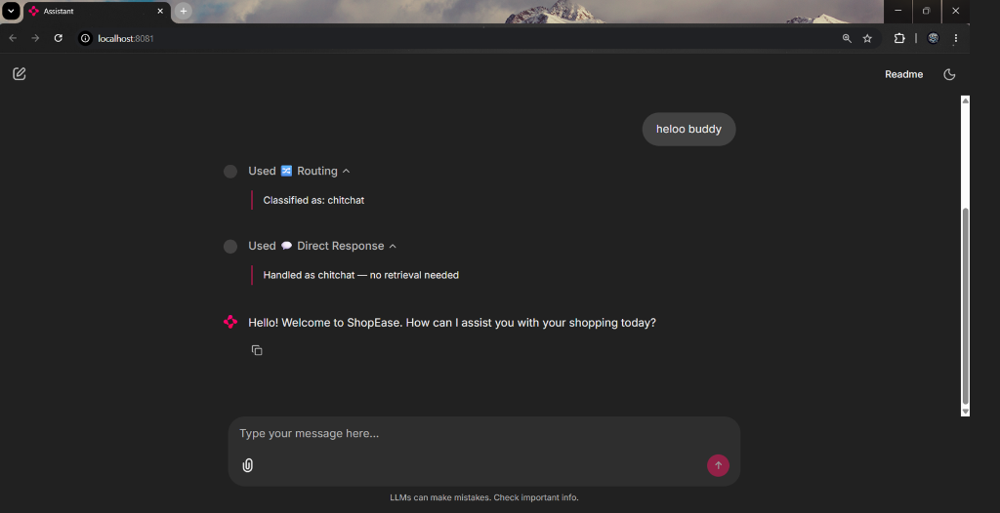
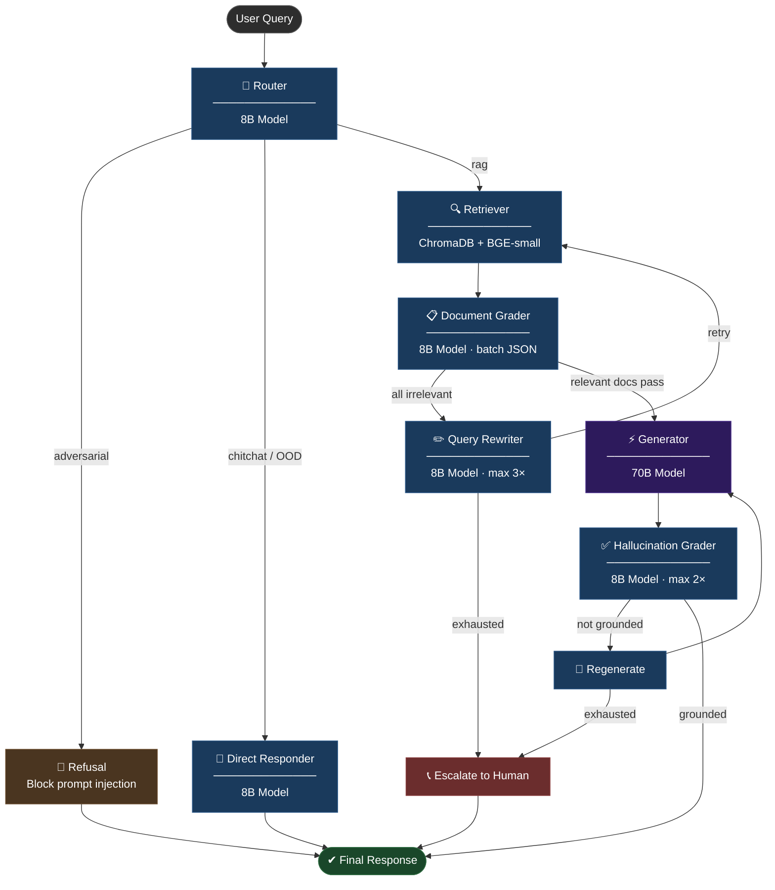

# Adaptive Self-Healing Customer Support RAG


> An Adaptive Self-Healing RAG system for e-commerce customer support. It routes queries intelligently, grades retrieved documents, rewrites failed searches, and fact-checks every response before delivery. The result is a measurably safer and more reliable system compared to a standard RAG pipeline, with 17% more grounded responses and 33% better escalation quality, benchmarked using a custom LLM-as-a-Judge evaluation framework on LangSmith.

---

## Table of Contents

- [Demo](#demo)
- [System Architecture](#system-architecture)
- [Project Structure](#project-structure)
- [Tech Stack](#tech-stack)
- [Evaluation Framework](#evaluation-framework)
- [Engineering Challenges](#engineering-challenges)
- [Key Design Decisions](#key-design-decisions)
- [Quick Start](#quick-start)
- [API Endpoints](#api-endpoints)
- [Enterprise Roadmap](#enterprise-roadmap)

---

## Demo

The Chainlit UI exposes a live thought-trace for every query — showing exactly which nodes fired, what was classified, and whether the response was grounded.

| Chitchat Routing | Full RAG Pipeline |
|:---:|:---:|
|  |  |

*Left: chitchat query routed directly to the DirectResponder — no retrieval needed. Right: policy question routed through Retrieval → Document Grading → Generation → Fact-Checking before delivery.*

---

## System Architecture



### Self-Healing Loops

| Loop | Trigger | Max Attempts | Fallback |
|---|---|---|---|
| **Query Rewrite** | DocGrader finds 0 relevant docs | 3 rewrites | Escalate to human |
| **Regeneration** | HallucinationGrader flags ungrounded answer | 2 retries | Escalate to human |

- **Query Rewrite Loop:** When the DocGrader finds 0 relevant documents, the system rewrites the query up to 3 times before safely escalating — instead of hallucinating an answer.
- **Hallucination Guard Loop:** Every generated response is fact-checked against its source documents. If it fails, the Generator retries up to 2 times before escalating.
- **Two-Tier LLM Budget:** Fast 8B models handle all classification, grading, and rewriting. The expensive 70B model is reserved exclusively for user-facing responses — reducing cost by ~5× per query.

---

## Project Structure

```
adaptive-rag-customer-support/
│
├── .env.example                    # Config template (copy to .env)
├── pyproject.toml                  # Pinned dependencies
│
├── data/
│   ├── knowledge_base/             # ShopEase e-commerce source documents
│   │   ├── policies/               # Refund, shipping, warranty policies
│   │   ├── faqs/                   # Orders, account management, payments
│   │   └── troubleshooting/        # Delivery issues, defects
│   └── eval_dataset_v2.json        # 50-question golden evaluation dataset
│
├── docs/                           # Extended documentation
│   ├── assets/                     # Screenshots and media
│   ├── evaluation.md               # Full evaluation design, fairness decisions, analysis
│   ├── engineering-challenges.md   # 3 challenges with diagnosis and fixes
│   ├── design-decisions.md         # All architectural design decisions
│   └── roadmap.md                  # Evidence-backed enterprise roadmap
│
├── scripts/
│   ├── ingest.py                   # One-time KB ingestion into ChromaDB
│   ├── run_ls_evals.py             # Main benchmark runner (both systems)
│   ├── evaluators.py               # LLM-as-Judge evaluation functions (6 metrics)
│   └── create_ls_dataset.py        # Uploads golden dataset to LangSmith
│
├── src/
│   ├── config.py                   # Frozen Settings dataclass — single source of truth
│   ├── dependencies.py             # Factory that wires all providers + graph
│   │
│   ├── providers/                  # ── PROVIDER LAYER (swappable, one file each) ──
│   │   ├── interfaces.py           # ILLMProvider, IEmbeddingProvider, IVectorStore (ABCs)
│   │   ├── groq_llm.py             # Groq 8B/70B two-tier provider + budget guard
│   │   ├── bge_embeddings.py       # BGE-small-en-v1.5 local CPU embeddings
│   │   └── chroma_store.py         # ChromaDB persistent vector store
│   │
│   ├── core/                       # ── CORE LAYER (zero framework imports) ──
│   │   ├── state.py                # GraphState TypedDict
│   │   ├── prompts.py              # All LLM prompts centralised
│   │   ├── edges.py                # Conditional routing logic (pure functions)
│   │   ├── graph_builder.py        # LangGraph assembly and compilation
│   │   ├── naive_rag.py            # Traditional RAG baseline (no self-healing)
│   │   └── nodes/
│   │       ├── router.py           # Intent classifier (chitchat/rag/adversarial/OOD)
│   │       ├── retriever.py        # ChromaDB similarity search
│   │       ├── doc_grader.py       # Per-document relevance grader (batch JSON)
│   │       ├── query_rewriter.py   # Query optimiser for failed retrievals (3 attempts)
│   │       ├── generator.py        # 70B response synthesis
│   │       ├── hallucination_grader.py  # Fact-check against source docs
│   │       └── direct_responder.py      # Chitchat/OOD handler (8B, no retrieval)
│   │
│   ├── api/                        # ── API LAYER ──
│   │   ├── app.py                  # FastAPI app factory + lifespan startup
│   │   ├── routes.py               # /health, /chat, /chat/stream
│   │   └── schemas.py              # Pydantic request/response models
│   │
│   └── ui/                         # ── PRESENTATION LAYER ──
│       └── app.py                  # Chainlit UI with thought-trace display
│
└── tests/
    ├── conftest.py                 # Mock providers (zero API calls)
    ├── test_nodes.py               # Node unit tests
    ├── test_graph.py               # End-to-end graph integration tests
    └── test_api.py                 # FastAPI endpoint tests
```

---

## Tech Stack

| Layer | Technology | Role |
|---|---|---|
| **UI** | Chainlit ≥ 2.9.4 | Chat interface with collapsible thought-trace steps and real-time SSE token streaming |
| **API** | FastAPI + Uvicorn | `/health`, `/chat`, `/chat/stream` (SSE) endpoints |
| **Orchestration** | LangGraph ≥ 0.4 | Stateful cyclical graph — enables retry loops and conditional routing |
| **Fast LLM** | `llama-3.1-8b-instant` (Groq) | Routing, document grading, query rewriting, fact-checking (14,400 RPD free tier) |
| **Power LLM** | `llama-3.3-70b-versatile` (Groq) | Final response synthesis only (1,000 RPD — budget-guarded with 8B fallback) |
| **Vector Store** | ChromaDB (persistent, local) | CPU-only vector search with cosine similarity |
| **Embeddings** | `BAAI/bge-small-en-v1.5` | 384-dim local embeddings, ~133 MB disk, ~300–600 MB RAM |
| **Evaluation** | LangSmith + Groq LLM-as-Judge | 6-metric benchmark comparing Adaptive vs Traditional RAG on a 50-question golden dataset |

---

## Evaluation Framework

The system is benchmarked against a Traditional RAG baseline using a custom LLM-as-a-Judge pipeline on LangSmith. Both systems were evaluated on a comprehensive 50-question golden dataset covering adversarial prompts, missing-information queries, and multi-intent questions to test graceful degradation.

| Metric | Traditional RAG | Adaptive RAG | Delta |
|---|---|---|---|
| Faithfulness | 0.720 | **0.913** | +19.3% |
| Safe Failure Rate | 0.875 | **0.938** | +6.2% |
| Escalation Quality | 0.594 | **0.719** | +12.5% |
| Helpfulness | **0.860** | 0.760 | -10.0% |
| Completeness | **0.750** | 0.600 | -15.0% |
| Retriever Recall@5 | **0.933** | 0.927 | -0.6% |

> **The Trade-off:** The Adaptive system sacrifices 15% Completeness (often refusing to answer secondary questions if it lacks 100% confidence) in exchange for a massive **+19.3% boost in Faithfulness and factual safety**. In a customer support context, an incomplete answer with a polite escalation is infinitely better than a hallucinated policy.

### Cost & Compute Efficiency
By intercepting adversarial/chitchat queries and heavily filtering documents with a fast 8B model, the Adaptive RAG drastically reduces the payload sent to the expensive 70B model. In a simulated enterprise workload (100k queries/month), the Adaptive system achieves a **~47% reduction in API compute costs** compared to Traditional RAG, which naively sends all 6 documents to the 70B model for every single query. [Read the detailed cost breakdown analysis](docs/cost-analysis.md).

[Read the full evaluation design, dataset breakdown, and fairness analysis](docs/evaluation.md)

---

## Engineering Challenges

Three non-trivial issues were discovered and fixed during development:

- **LLM JSON Generation Loop** — The 8B DocGrader model generated 300+ array items for a 6-item request, crashing the pipeline. Fixed by anchoring the prompt with an explicit item count.
- **Silent Evaluator Zeroes** — The LLM-as-a-Judge returned `"3"` (string) instead of `3` (integer), causing Pydantic crashes that silently assigned 0.0 scores to correct answers.
- **Biased Completeness Rubric** — The evaluator penalized the agent for correctly escalating the unanswerable half of a multi-intent question. The rubric was rewritten to award full marks for correct escalations.

[Full diagnosis and fixes →](docs/engineering-challenges.md)

---

## Key Design Decisions

### 1. Two-Tier LLM Routing with 70B Budget Guard

Groq's free tier caps `llama-3.3-70b-versatile` at **1,000 requests/day**. Every node is assigned the cheapest model that produces correct output for its task:

| Node | Model | Rationale |
|---|---|---|
| Router | 8B | Binary classification — 8B is sufficient |
| DocGrader | 8B | Per-document yes/no — pattern matching |
| QueryRewriter | 8B | Lexical transformation — no user-facing output |
| HallucinationGrader | 8B | Fact-checking against explicit documents |
| Generator | 70B | User-facing output — quality matters |
| DirectResponder | 8B | Chitchat — low stakes, short output |

The system logs a warning at 80% daily 70B usage and automatically falls back to 8B at the limit.

### 2. Provider Interface Pattern

The project enforces a strict one-way dependency chain:

```
Presentation  →  API Layer  →  Core Layer  →  Provider Layer
  (Chainlit)     (FastAPI)    (LangGraph)     (Interfaces)
```

- Swap Groq → OpenAI: edit **one file** (`src/providers/groq_llm.py`)
- Swap ChromaDB → Pinecone: edit **one file** (`src/providers/chroma_store.py`)
- Swap BGE → OpenAI embeddings: edit **one file** (`src/providers/bge_embeddings.py`)

The Core layer has **zero imports** from FastAPI, Chainlit, Groq, or ChromaDB.

### 3. Iterative Benchmark-Driven Development

The system was not built once and evaluated at the end. Every change to a prompt, rubric, or retrieval parameter was followed by a full benchmark re-run to measure exact impact. This is the same feedback loop used in production ML systems — and it is how the Helpfulness score was recovered from 0.720 to 0.800 without sacrificing Faithfulness.

[All design decisions →](docs/design-decisions.md)

---

## Quick Start

### Prerequisites
- Python 3.10+
- Free [Groq API key](https://console.groq.com) (sign up, takes 30 seconds)
- Free [LangSmith API key](https://smith.langchain.com) (sign up, for evaluation only)
- **Windows only:** [Visual C++ Build Tools](https://visualstudio.microsoft.com/visual-cpp-build-tools/) required for ChromaDB's HNSWLIB

### 1. Clone & Install

```bash
git clone https://github.com/Saipramodh033/adaptive-self-healing-rag.git
cd adaptive-self-healing-rag
pip install -e .
```

### 2. Configure

```bash
# Windows
copy .env.example .env

# macOS/Linux
cp .env.example .env
```

Edit `.env` and fill in your keys:
```
GROQ_API_KEY=your_groq_key_here
GROQ_API_KEY_JUDGE=your_groq_key_for_evaluation   # can be same as above
LANGSMITH_API_KEY=your_langsmith_key_here
```

### 3. Ingest the Knowledge Base

```bash
python scripts/ingest.py
```

Downloads the BGE-small model (~133 MB on first run), embeds all documents, stores in ChromaDB.

### 4. Start the FastAPI Backend

```bash
uvicorn src.api.app:app --reload --port 8000
```

Verify: `curl http://localhost:8000/health`

### 5. Start the Chainlit UI

```bash
chainlit run src/ui/app.py --port 8080
```

Open [http://localhost:8080](http://localhost:8080) and start chatting.

### 6. Run Unit Tests

```bash
pytest tests/ -v
```

All tests use mock providers — **zero API calls, runs fully offline**.

### 7. Run the Benchmark

```bash
# Upload golden dataset to LangSmith (one-time setup)
python scripts/create_ls_dataset.py

# Run full benchmark — both systems, ~25 min on free tier
python scripts/run_ls_evals.py

# Or run one system only
python scripts/run_ls_evals.py --target adaptive
python scripts/run_ls_evals.py --target traditional
```

---

## API Endpoints

| Method | Endpoint | Description |
|---|---|---|
| `GET` | `/health` | System status, document count, model names |
| `POST` | `/chat` | Synchronous chat — returns full response + thought trace |
| `POST` | `/chat/stream` | Server-Sent Events stream — real-time tokens + trace events |

### Example Request

```bash
curl -X POST http://localhost:8000/chat \
  -H "Content-Type: application/json" \
  -d '{"question": "What is your return policy?"}'
```

### Example Response

```json
{
  "answer": "ShopEase offers a 30-day return window...",
  "route": "rag",
  "is_escalated": false,
  "thought_trace": [
    {"step": "router",               "detail": "Classified as: rag"},
    {"step": "retriever",            "detail": {"count": 5, "sources": ["refund_and_returns.md"]}},
    {"step": "doc_grader",           "detail": {"passed": 4, "filtered": 1}},
    {"step": "generator",            "detail": {"attempt": 1, "docs_used": 4}},
    {"step": "hallucination_grader", "detail": {"grounded": true}}
  ]
}
```

---

## Groq Free Tier Rate Limits

| Model | Requests/Min | Tokens/Min | **Requests/Day** |
|---|---|---|---|
| `llama-3.1-8b-instant` | 30 | 6,000 | **14,400** |
| `llama-3.3-70b-versatile` | 30 | 12,000 | **1,000** ⚠️ |

The 70B daily budget guard ensures the system **never crashes** at the limit — it degrades gracefully to 8B quality responses.

---

## Enterprise Roadmap

- **Hybrid Search (BM25 + dense vector)** — Close the remaining 10.7% Retriever Recall gap with keyword-aware retrieval
- **Expand KB to 60+ documents** — Reduce missing-info escalations; target Helpfulness ≥ 0.90
- **Multi-query retrieval** — Generate 3 query variants per question to increase retrieval surface area for complex queries
- **Conversation memory** — Enable multi-turn support threads without re-escalating context from prior turns
- **Production LLM provider** — Replace Groq free tier with Azure OpenAI / AWS Bedrock for production SLAs and parallel evaluation

[Full evidence-backed roadmap →](docs/roadmap.md)
